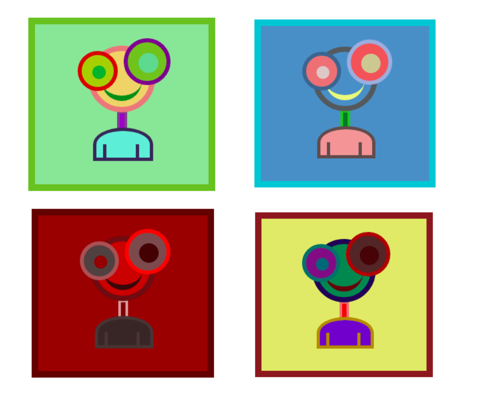

# Crypto Boy NFT + Combined
<i>NFT marketplace DApp where users mint ERC721 implemented Crypto Boy NFTs.</i>
#
</img>
### Features
- Mint custom ERC721 implemented Crypto Boy Tokens.
- Combine the ERC 721 Token to make on token with all traits.
- Sell Crypto Boy tokens on the marketplace.
- Set desired token price.
- Toggle between keeping the token for sale and not for sale.
- Keeps track of all the tokens owned by an account - minted and bought.
- Query blockchain for token owner and token metadata.

### Stack
- [Solidity](https://docs.soliditylang.org/en/v0.7.6/) - Object-oriented, high-level language for implementing smart contracts.
- [Bootstrap 4](https://getbootstrap.com/) - CSS framework for faster and easier web development.
- [React.js](https://reactjs.org/) - JavaScript library for building user interfaces.
- [web3.js](https://web3js.readthedocs.io/en/v1.3.4/) - Allows users to interact with a local or remote ethereum node using HTTP, IPC or WebSocket.
- [Truffle](https://www.trufflesuite.com/truffle) - Development environment, testing framework and asset pipeline for blockchains using the Ethereum Virtual Machine (EVM).
- [Ganache](https://www.trufflesuite.com/ganache) - Personal blockchain for Ethereum development used to deploy contracts, develop DApps, and run tests.
#

### Run the DApp Locally
#### Install truffle
```
npm install -g truffle
```

#### Install dependencies
```
cd cryptoboys-NFT-marketplacenpm install
```
#### Compile smart contract
```
truffle compile
```
#### Deploy smart contract to kovan
```
truffle migrate --network testnet
```
#### Test smart contract
```
truffle test
```
#### Start DApp
```
npm start
```

myetherwallet.com
